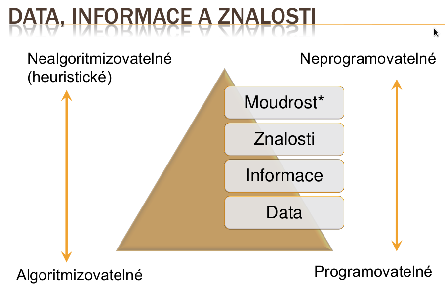

==========
Ontologické inženýrství: pojem ontologie v kontextu informatiky, základní stavební prvky ontologií, typy ontologií, jazyky ontologického modelování, návrhové vzory, normalizace ontologie. Odvozování nad ontologií (kontrola konzistence, klasifikace), nástroje, použití ontologií.
==========

Index
-------

* Typy tříd
* Třídy a jejich vymezení
* Sémantika tříd
* Odvozovací stroje
* Princip otevřeného světa
* Princip jedinečného jména

Ontologické inženýrství: pojem ontologie v kontextu informatiky, základní stavební prvky ontologií,
------

Etymologie: z řeckého ontos (bytí, to co jest) a logos (slovo, řeč, význam)
* Původně podoblast filosofie, která se zabývá bytím a podmínkami existence věcí okolo nás
* Oblast zájmu - co existuje nebo by mohlo existovat v našem světě, jsoucno a jeho podstata

V kontextu informatiky (Sowa):
"""""""
„Předmětem ontologie je studium kategorií věcí, které existují nebo mohou existovat v určité doméně. Výsledek tohoto studia, nazývaný ontologie, je katalog věcí, jejichž existenci předpokládáme v dané doméně D, z perspektivy osoby používající jazyk L, aby mluvila o D. “

Gruber:
"""""""
„Ontologie je explicitní specifikace konceptualizace.“

Řeší, jak znalosti
* Získávat
* Sdílet
* Uchovávat (reprezentovat, modelovat)
* Zpracovávat a používat
* Předávat
* Vytvářet
 

ONTOLOGIE V KOMUNIKACI
"""""""

* Komunikace člověk – člověk
* Stačí jednoznačná, neformální ontologie 
* Komunikace mezi znalostním inženýrem a expertem
* Usnadňuje učení, vzájemné pochopení
* Podpora sběru požadavků pro budoucí IS/ZS

* Komunikace počítač – počítač
* Podpora komunikace mezi různými počítačovými systémy s pomocí jednotného „slovníku“
* Zajišťuje jednoznačné reference na pojem/objekt
* Ontologie je součástí formátu výměny dat

STROJOVÉ ZPRACOVÁNÍ ZNALOSTÍ
""""""

* Umělá inteligence
* Systémy pro správu obsahu (CMS)
* Inteligentní agenty
* E-learning
* Zpracování přirozeného jazyka (NLP)
* Sémantický web
* Vizualizace informací a znalostí
* XML Topic Maps

ZÁKLADNÍ POJMY
""""""

* Znalosti – pochopení souvislostí získané zkušeností nebo studiem, schopnost osoby provádět specializovanou činnost - výrok s určitou mírou pravdivosti
* Procedurální pravidlo –popisuje souvislosti mezi určitými prvky reality (přecházení cesty)
* Heuristika – nealgoritmický postup který optimalizuje nebo zlepšuje řešení, tzv. „zdravý rozum“, obvykle založený na dlouhodobých
zkušenostech

Typy tříd
--------

Třída
""""""""

* Základní konstrukční prvek
* Slouží jako předpis pro jedince (nikoliv objekty)
* Analogie s třídou z objektovéhoprogramování
* Protégé implicitně obsahuje nejméně jednu základní, zcela obecnou třídu owl:Thing, od níž jsou odvozeny všechny ostatní třídy

* Primitivní třída  Primitive Class
* Definovaná třída Definable Class
* Přídavná třída   Modifier Class
* Anonymní třída   Anonymous Class
* Testovací třída  Test Class

Primitivní třída
^^^^^^^^^

* Výchozí typ třídy
* Obsahuje:
	* Název (musí být zřejmé, jakou část reality reprezentuje)
	* Popis (vlastnosti, které ji charakterizují)
* V přirozeném jazyce se obvykle jedná o
podstatné jména
* Modeluje se jako neúplná třída – pouze omezení v bloku necessary

DEFINOVANÁ TŘÍDA (DEFINABLE CLASS) 1
^^^^^^^^^^^

* Třída vymezená přesnou definicí
	* Může u ní být uveden popis
	* Obecně nemusí existovat pouze jeden správný popis definované třídy, věci lze definovat různými způsoby
* Def. třída vytváří kategorie, do nichž se po
aplikaci klasifikátoru (odvození) odvodí třídy
odpovídající definici

DEFINOVANÁ TŘÍDA (DEFINABLE CLASS) 2
^^^^^^^^^^^

* Obvykle odpovídá konceptu, k jehož vymezení jsou použity jiné koncepty, např.
* Stařec (člověk, který je starý)
* Student (člověk, který studuje)
* Matka (člověk ženského pohlaví, který má alespoň jednoho potomka)

* Modeluje se pomocí omezení v bloku necessary and sufficient, případně dále i
pomocí omezení v bloku necessary

PŘÍDAVNÁ TŘÍDA (MODIFIER CLASS)
^^^^^^^^^^^

* Je typem třídy, která slouží k upřesnění jiných pojmů
* Obvykle v přirozeném jazyce odpovídá přídavnému jménu (šedý, mladý, náročné, dlouho, levně) – otázka JAKÝ?
* Příslovci – otázka JAK?
* Modeluje se použitím návrhového vzoru „Rozklad třídy na podtřídy“

ROZKLAD TŘÍDY NA PODTŘÍDY
^^^^^^^^^^^

* Nadřazená třída představuje dimenzi (nějakou vlastnost, atribut), kterou chceme modelovat
* Podtřídy představují možné hodnoty, kterých tato dimenze může nabývat
* Hodnoty dimenze jsou navzájem různé, musí být disjunktní

ANONYMNÍ TŘÍDA (ANONYMOUS CLASS)
^^^^^^^^^^^^^
* Je bezejmenná (odtud název)
* Vymezena pomocí logických výrazů:
* Sjednocení (OR)
* Průnik (AND)
* Doplněk (NOT)
* Výčtem (specifikuje členství v dané třídě)
* Omezeními (vztahují se k použité vlastnosti)

* Třída nemá explicitní vyjádření v hierarchii tříd
* Do anonymní třídy spadají jedinci, kteří splňují určitou logickou definici

VYMEZENÍ TŘÍDY
---------

Tři možné přístupy
* Vymezení popsáním (částečné)
* Vymezení definováním (úplné)
* Vymezení výčtem (úplné)

Důležité je mít jasno v otázkách:
* Jaký je význam třídy?
* Kteří jedinci do třídy patří a kteří ne?
* Jak posoudit, zda jedinec do třídy patří?

*Vymezení určuje význam třídy v kontextu jiných
tříd*

VYMEZENÍ TŘÍDY POPSÁNÍM
"""""""""

* Třída je vymezena použitím jejích charakteristik
* Je uveden výčet vlastností, které třída má
* Hrozí rozpor mezi výčtem charakteristik a tím, co se nám do třídy řadí – popsání třídy nemusí nutně stačit pro jednoznačné a správné zařazení jedince do třídy
* Výčet vlastností musí být dosti detailní, aby
zařazení fungovalo správně

DŮLEŽITOST POPISU TŘÍD
^^^^^^^

*Jazyk OWL je založený na deskripční logice*

* Popis třídy dovoluje ověřit, zda jedinec skutečně do dané třídy patří, zda splňuje
daná kriteria
* Uvažování s použitím klasifikátoru – nástroje
pro odvozování implicitních souvislostí v
rámci ontologie

VYMEZENÍ TŘÍDY DEFINOVÁNÍM
"""""""""

Jednoznačné zařazení jedince do třídy

Příklad:
„Každá sýrová pizza má sýrovou přísadu“
„CheesePizza hasTopping some CheeseTopping“

Definice třídy
Jestliže je něco sýrová pizza, pak patří do třídy Pizza a zároveň patří do třídy všech jedinců, kteří obsahují sýrovou přísadu
<=
Jestliže je něco Pizza a obsahuje sýrovou přísadu, pak patří do
třídy sýrová pizza

Tzn. třída je vymezená popsáním + zavádí se ekvivalence
„Sýrová pizza je totéž, co pizza se sýrovou přísadou“

VYMEZENÍ TŘÍDY VÝČTEM
""""""""""

*Je uveden výčet jedinců, kteří do třídy patří*
* Tím je třída vymezena jednoznačně, není sporu co do třídy patří a co ne

Omezení
-------

OMEZENÍ SOME VALUES FROM
"""""""

Alespoň jedna hodnota vlastnosti musí být uvedeného typu

* Mohou existovat i další hodnoty
* Příklad: Sýrová pizza je taková pizza, že alespoň jedna její přísada je sýrová
* Z toho mj. plyne, že sýrová pizza má alespoň jednu přísadu (sýr)

OMEZENÍ ALL VALUES FROM
""""""

* Všechny hodnoty vlastnosti musí být uvedeného typu Pozor na triviální splnění omezení:
* Jestliže jedinec nemá danou vlastnost, splňuje omezení allValuesFrom, což znamená

Ze splnění omezení allValuesFrom neplyne splnění omezení someValuesFrom
Příklad: vegetariánská pizza je taková pizza, že všechny její přísady jsou zeleninové nebo sýrové

Nevíme, zda nějakou přísadu vůbec má

* přednášky ZT1 na https://github.com/michaelkuty/ssz-ai-hk-3/tree/gh-pages/source/prednasky/zt1/

klasifikace
--------

VYUŽITÍ KLASIFIKÁTORŮ
""""""

Strojové zpracování znalostí bez asistence člověka (sémantický web)

Zvyšování kvality ontologie:
* Smysluplnost – všechny pojmenované třídy mohou mít instance
* Korektnost – zachycení znalostí doménovýchexpertů
* Minimální redundance – žádná neúmyslná synonyma
* Bohatá axiomatizace – detailní popis tříd

ÚČEL KLASIFIKÁTORU (1)
""""""

* Usnadnění tvorby ontologie 
* Klasifikací jsou odvozeny nové vztahy, které nebyly přímo vloženy tvůrcem

Klasifikátor provádí:
* Kontrolu konzistentnosti (zda si jednotlivé části ontologie logicky vzájemně neodporují)
* Klasifikaci tříd (kontrola příslušnosti tříd, tj. isA relací – tvoří hierarchickou strukturu ontologie)
* Klasifikace jedinců

RINCIP UZAVŘENÉHO SVĚTA - PRINCIP CWA (CLOSE WORLD ASSUMPTION)
""""""

Nějaké tvrzení o světě může být pravdivé, nepravdivé nebo nerozhodnutelné.
V uzavřeném světě nepředpokládáme, že budo zjišťovány nové skutečností, které by mohly změnit náš aktuální pohled na svět.

Předpoklady uzavřeného světa (Prolog):
 „Jestliže o tvrzení X neumím prokázat, že je pravdivé, pak přijmu závěr, že tvrzení X je nepravdivé.“
 „Jestliže se neprokáže nevina, pak je obžalovaný vinen.“

PRINCIP OTEVŘENÉHO SVĚTA PRINCIP OWA (OPEN WORLD ASSUMPTION)
""""""

V otevřeném světě předpokládáme, že časem bude možné přidat další informace k aktuálnímu stavu zkoumání dané
domény
Předpoklad otevřeného světa:
* „Jestliže tvrzení X (obžalovaný je nevinen) není pravdivé, pak tvrzení X může být jak nepravdivé (tudíž obžalovaný
je vinen) tak nerozhodnutelné.“
* „Jestliže se neprokáže nevina, pak nelze usuzovat, že obžalovaný je vinen.“

Opatrný přístup
* „Jestliže je nějaké tvrzení nerozhodnutelné, a později získám znalosti k určení jeho pravdivosti, není nutné
přehodnotit předchozí závěry.“

OWA VS. CWA VE VZTAHU K ODVOZOVÁNÍ
"""""

Databáze je příkladem uzavřeného světa:
* Hledáme osobu X v živnostenském rejstříku, která provozuje činnost Y Možný výsledek: „Osoba nenalezena.“
* V principu OWA bychom řekli, že daná osoba není živnostník 
* To, co není v databázi, neexistuje 
* Při použití klasifikátoru bychom jen na základě neobdržení dat nemohli konstatovat, že živnostník neexistuje
* Klasifikátor může rozhodnout, když má explicitně vyjádřené informace
