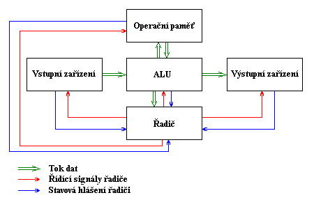
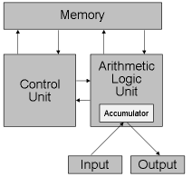
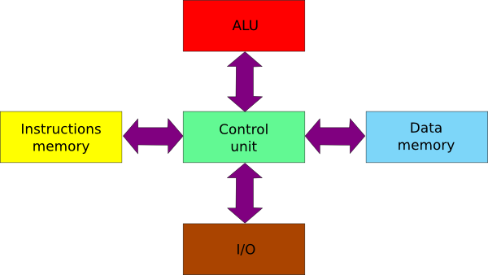

======
Otázka č.2: Architektura počítače (von Neumannovo a Harwardské schéma, Flynnova taxonomie, základní deska, procesor, mikroarchitektura procesoru, paměti, sběrnice, řadič, přídavné karty, ovladače).
======

Von Neumannovo schéma bylo navrženo roku 1945 americkým matematikem (narozeným v Maďarsku) Johnem von Neumannem jako model samočinného počítače. Tento model s jistými výjimkami zůstal zachován dodnes.

Podle tohoto schématu se počítač skládá z pěti hlavních modulů:

* Operační paměť (memory): slouží k uchování zpracovávaného programu, zpracovávaných dat a výsledků výpočtu
* ALU - Arithmetic-Logic Unit (aritmetickologická jednotka): jednotka provádějící veškeré aritmetické výpočty a logické operace. Obsahuje sčítačky, násobičky (pro aritmetické výpočty) a komparátory (pro porovnávání)
* Řadič (control unit): řídící jednotka, která řídí činnost všech částí počítače. Toto řízení je prováděno pomocí řídících signálů, které jsou zasílány jednotlivým modulům. Reakce na řídící signály, stavy jednotlivých modulů jsou naopak zasílány zpět řadiči pomocí stavových hlášení
* Vstupní zařízení (input): zařízení určená pro vstup programu a dat.
* Výstupní zařízení (output): zařízení určená pro výstup výsledků, které program zpracoval

Ve von Neumannově schématu je možné ještě vyznačit dva další moduly vzniklé spojením předcházejících modulů:
* Procesor: Řadič + ALU
* CPU - Central Processor Unit (centrální procesorová jednotka): Procesor + Operační paměť

Von Neumannova architektura
------

| počítač (mikroprocesor) se skládá z pěti funkčních bloků - paměti, řadiče, aritmeticko-logické jednotky (ALU) a vstupních a výstupních jednotek,
struktura počítače je nezávislá na typu řešení úlohy a je řízena obsahem paměti,
| instrukce a operandy jsou uloženy v téže paměti,
| paměť je rozdělena do buněk stejné velikosti, jejichž pořadová čísla se používají jako adresy,
| program je tvořen posloupností elementárních příkazů (instrukcí), v nichž zpravidla není obsažena hodnota operandu (uvádí se pouze jeho adresa), takže | program se při změně dat nemění; instrukce se provádějí jednotlivě v pořadí, v němž jsou zapsány do paměti,
| změna provádění instrukcí se vyvolá instrukcí podmíněného a nepodmíněného skoku,
| pro reprezentaci instrukcí a čísel (operandů, výsledků, adres apod.) se používají dvojkové signály a dvojková číselná soustava.
| Tato koncepce ovlivnila výrobu počítačů a pak i mikroprocesorů až do osmdesátých let minulého století, kdy se objevil první signálový procesor s harvardskou architekturou

Princip činnosti počítače podle von Neumannova schématu:

1. Do operační paměti se pomocí vstupních zařízení přes ALU umístí program, který bude provádět výpočet.
2. Stejným způsobem se do operační paměti umístí data, která bude program zpracovávat
3. Proběhne vlastní výpočet, jehož jednotlivé kroky provádí ALU. Tato jednotka je v průběhu výpočtu spolu s ostatními moduly řízena řadičem počítače. Mezivýsledky výpočtu jsou ukládány do operační paměti.
4. Po skončení výpočtu jsou výsledky poslány přes ALU na výstupní zařízení.

Základní odlišnosti dnešních počítačů od von Neumannova schématu:
· Podle von Neumannova schématu počítač pracuje vždy nad jedním programem. Toto vede k velmi špatnému využití strojového času. Je tedy obvyklé, že počítač zpracovává paralelně více programů zároveň - tzv. multitasking
· Počítač může disponovat i více než jedním procesorem – tzv. multiprocessing
· Počítač podle von Neumannova schématu pracoval pouze v tzv. diskrétním režimu
· Existují vstupní / výstupní zařízení I/O devices, která umožňují jak vstup, tak výstup dat (programu)
· Program se do paměti nemusí zavést celý, ale je možné zavést pouze jeho část a ostatní části zavádět až v případě potřeby
Diskrétní režim (protected mode - chráněný režim, též ochranný režim)
Provozní režim procesorů Intel 80x86 a kompatibilních, při kterém je k dispozici větší paměťový prostor, možnosti multitaskingu a možnost využití virtuální paměti. V chráněném režimu pracuje automaticky operační systém OS/2, Windows NT a většina systémů UNIX.

Reálný režim (real mode) 
------
 Druh paměťového režimu u počítačů založených na procesoru Intel 80x86. Je to jediný režim, který přímo podporuje operační systém MS-DOS. Hlavními znaky tohoto režimu je, že podporuje pouze jednoúlohové prostředí (tedy neumožňuje pravý multitasking) a že dokáže přímo zpřístupnit pouze paměť do 1 MB. Druhým režimem, který podporují procesory této řady, je chráněný režim.

Multiprocessing 
------
 Souběžné zpracování více úloh nebo podúloh. Systému s více procesory schopnému zpracovávat více úloh současně říkáme víceprocesorový systém. Ve víceprocesorovém systému jsou běžící procesy přiděleny ke zpracování jednotlivým procesorům, přičemž ty obvykle vykonávají různé části kódu a vyměňují si s ostatními procesory např. data a výsledky své činnosti.
 
Multitasking 
------
 Současné provádění více programových aplikací. V režimu multitasking je výpočetní čas procesoru počítače (CPU) rozdělen mezi současně spuštěné aplikace, takže vzhledem k rychlosti procesoru vzniká dojem současného zpracovávání více úloh. Multitasking je vlastností operačního systému a pravým multitaskingem disponují až pokročilé systémy, jako je MS Windows NT nebo systémy UNIX. Systém MS Windows umožňuje rovněž spouštět více aplikací, nicméně se nejedná o „pravý“ multitasking, ale o přepínání mezi více spuštěnými aplikacemi v dosti velkých časových intervalech (tzv. task swapping).

Harvardské schéma
------

Harvardská architektura má na rozdíl od von Neumanovy architektury oddělený paměťový prostor pro data a pro program. Harvardská koncepce dovoluje používat pro paměť programu například paměti typu ROM (Read Only Memory) a umožňuje v podstatě zdvojnásobení velikosti paměti oproti von Neumanově architektuře při stejně veliké adresové sběrnici. Bit nutný pro realizaci této možnosti je obsažen v instrukčním souboru, který obsahuje instrukce pro komunikaci s datovou pamětí. U von Neumanovy koncepce je paměť pro data a pro program společná. Tímto způsobem se můžeme na instrukce dívat jako na data a během programu je můžeme měnit a ovlivňovat chování programu.

Harvardská architektura
-------
Tato architektura byla navržena Howardem Aikenem v třicátých letech minulého století na Harvardské univerzitě ve Spojených státech při vývoji reléového počítače HARVARD MARK 1 (1944). Dále byla využita na Pensylvánské univerzitě pro elektronkový počítač ENIAC (Electronic Numerical Integrator and Calculator). Již tehdy byla moderní koncepcí, ale technické prostředky v té době neumožnily její realizaci, a proto byla zavržena a byla převzata koncepce von Neumannova. Později asi po čtyřiceti letech dosáhla technologie výroby integrovaných obvodů takového stupně, že mohla být tato koncepce realizována. 

Základní principy harvardské architektury jsou:

* paměť je rozdělena na paměť programu a dvě paměti dat tak, aby současně mohly dva operandy vstupovat do ALU,
* součin dvou operandů v jednom instrukčním cyklu provede hardwarová násobička a výsledek součinu je přičten k akumulátoru (operace typu MAC - Multiply And Accumulate),
* pro zvýšení výpočetní výkonnosti se používá pipelining (zřetězené zpracování instrukcí),
* je zvýšen počet samostatných datových a adresových sběrnic a přímý přístup do paměti je prováděn vícenásobným kanálem DMA (Direct Memory Access),
* řízení jádra procesoru je odděleno od řízení vstupních a výstupních jednotek a architektura typu 1X a 2X znamená, že jedna instrukce je provedena v jednom nebo ve dvou hodinových cyklech (taktech). 

Flynnova taxonomie
------

Flynnova klasifikace je zřejmě nejznámější klasifikací paralelních systémů, vznikla v roce 1966. Systémy jsou klasifikovány podle dvou hledisek - toku instrukcí a toku dat. Klasifikace obsahuje 4 hlavní typy paralelních systémů a další 2 rozšiřující typy.

* SISD (s jedním tokem instrukcí, s jedním tokem dat): Počítač zpracovává data sériově podle jednoho programu. Takto pracuje například počítač von Neumannova typu.
* SIMD (s jedním tokem instrukcí, s vícenásobným tokem dat): Počítač používající více stejných procesorů, které jsou řízeny společným programem. Zpracovávaná data jsou různá, takže každý procesor pracuje s jinou hodnotu, ale všechny procesory současně provádějí stejnou instrukci.
* MISD (s vícenásobným tokem instrukcí, s jedním tokem dat): Tento typ se v praxi prakticky nepoužívá. Vznikl spíše pro doplnění jednotlivých kategorií.
* MIMD (s vícenásobným tokem instrukcí, s vícenásobným tokem dat): Víceprocesorový systém, v němž je každý procesor řízen vlastním programem a pracuje na vlastních datech.
* MSIMD (vícenásobné SIMD): V tomto systému pracuje několik podsystémů SIMD nezávisle na sobě. Jednotlivé podsystémy zpracovávají jiný program, proto musí být řízeny stejně jako systém MIMD.
* SPMD (stejný program, s vícenásobným tokem dat): Všechny procesory vykonávají stejný program, ale jsou na sobě nezávislé (nejsou synchronizovány). Jednotlivé procesory musí mít svůj řadič, který řídí rychlost přísunu instrukcí a jejich provádění.

Základní deska PC, procesor, chipset, sběrnice
------

Základní deska (mainboard)
------
Obvody umístěné na desce plošného spoje mainboardu slouží především pro podporu mikroprocesoru a sběrnic, konektory propojují jednotky umístěné mimo mainboard (pevné disky, operační paměti…). Mainboard je základním prvkem PC, spojuje všechny další zařízení.
Základní desky nemají stejné rozměry a nemusí jít umístit do každé skříně (většinou se ale dodržují dvě základní velikosti). Úkolem výrobce je vyrobit desku co nejuniverzálněji, aby spolupracovala s co největším počtem dalších komponent.
K „dorozumívání“ desky (o vybavení na hardwarové úrovni) s operačním systémem slouží speciální program BIOS, který je umístěn v paměti typu ROM v DIP pouzdře. Výstupy BIOSu jsou vzhledem k OS přesně definovány, vstupy od hardwaru jsou však různé. Nejznámější výrobci BIOSů jsou AMI (American Megatrens Incorporated), Award a Phoenix. Ke konfiguraci BIOSu slouží program SETUP.
Propojky (jumpery) - některé parametry základní desky je v zájmu univerzálnosti nutné nastavit nezávisle na BIOSu a toto nastavení se provádí pomocí jumperů. Jumper je skupina kontaktů (pinů), které můžeme propojit, a nastavit tak určitou vlastnost mainboardu. Propojení se provádí podle dokumentace k základní desce.
Přepínače (switch) - vyskytovaly se hlavně u starších desek, bývaly sdružovány do větších celků a sloužily také k definování vlastností desky pomocí polohy ON/OFF.

Prvky základní desky:

1. patice ZIF (zero input force) pro mikroprocesor
2. patice s obvody DIP, v kterých je umístěna cache L2 (vedle mikroprocesoru)
3. baterie pro napájení CMOS
4. rozšiřující sloty ISA, PCI, AGP
5. konektor integrovaného VGA adaptéru
6. konektory integrovaného rozhraní I/O a integrovaného rozhraní IDE pro HDD a disketové mechaniky
7. banky pro obvody operační paměti
8. konektor myši PS/2
9. připojení klávesnice (vedle konektoru pro myš)
10. napájení základní desky (vzadu u konektoru klávesnice)
11. + další neoznačené obvody pro podporu mikroprocesoru (nazývané chipset)

Mikroprocesor
------
Mikroprocesor je „mozkem“ počítače, který slouží k zpracování instrukcí od programů, kterými je řízen. Některé instrukce zpracovává sám, k provedení některých dalších instrukcí používá různé komponenty počítače (např. operační paměť, disky, sběrnice, displej nebo tiskárny). Základní vlastností mikroprocesoru je vytváření dat podle pokynů určitého programu. Jeho kvalita podstatně ovlivňuje rychlost a výkonnost počítače.
Jádrem každého mikroprocesoru je logický obvod, který dokáže zpracovat sadu jednoduchých mikroinstrukcí. Mikroinstrukce jsou jen jednoduché příkazy. Každý mikroprocesor je navíc vybaven instrukční sadou, která programátorům poskytuje přívětivější prostředky pro napsání složitějšího aplikačního programu. Převod instrukční sady na mikroinstrukce, které je mikroprocesor schopen řešit, obstarává program napsaný v mikroinstrukcích. Ten je další podstatnou částí mikroprocesoru.
Dnes se uplatňují dvě koncepce mikroprocesorů: RISC a CISC, které se liší ve velikosti instrukční sady. CISC, tedy Complete Instruction Set Computer je řešením, kdy je mikroprocesor vybaven co nejúplnější instrukční sadou, a mikroprocesor RISC, tzn. Reduced Instruction Set Computer, pak obsahuje jen základní instrukce, které jsou jednodušší a rychleji proveditelné. Procesory RISC jsou rychlejší, uplatnily se ale jen v mikroprocesoru PowerPC (u IBM, Applu, Motoroly) a u velkých nebo jednoúčelových počítačů. U osobních počítačů převládají mikroprocesory CISC (u Intelu, AMD, Cyrixu), které stále více začínají uplatňovat prvky procesorů RISC.
Každý mikroprocesor obsahuje registry. Ty fungují jako vnitřní paměti mikroprocesorů, do kterých se ukládají momentálně zpracovávaná data. Počet registrů a jejich přesné použití se u jednotlivých mikroprocesorů liší. K specifikaci adres v paměti, na kterých se nacházejí zpracovávaná data, se používají různé způsoby adresovacích mechanismů.
Instrukční sada mikroprocesoru musí obsahovat instrukce pro přesuny dat mezi pamětí a registry, aritmetické a logické funkce, instrukce pro řízení programu a několik systémových instrukcí.
Mikroprocesor vyhodnocuje během své činnosti celou řadu přerušení, tzn. signálů, které vysílají hardwarová zařízení nebo programy. Snad všechny moderní mikroprocesory mají vektorový systém přerušení. Vektory uložené v operační paměti, identifikované číslem přerušení, ukazují na adresu v paměti, kde je uložen obslužný program přerušení. Aby se po zpracování přerušení mohl procesor vrátit ke své původní činnosti, ukládá svůj momentální stav do speciálního registru - do zásobníku. Mikroprocesor také může přerušení dočasně zakázat.
Paměť spravuje mikroprocesor pomocí jednotek správy paměti, které v paměti překládají adresy tak, aby to bylo výhodné pro operační systém. Jednotky správy paměti zabezpečují také ochranu paměti, zabraňují programům v narušení běhu ostatních programů nebo operačního systému.
Mikroprocesory dále obsahují paměť cache, která je jakýmsi meziskladem dat mezi různě rychlými komponentami počítače. Účelem této paměti je vyrovnávání rychlostí v přenosu dat. Paměť L1 cache slouží k přechovávání dat ze sběrnice, na základní desce je pak instalovaná paměť cache L2, která optimalizuje přesuny dat mezi mikroprocesorem a operační pamětí.
Schopnost mikroprocesoru zpracovávat posloupnost instrukcí se nazývá architektura mikroprocesoru. Instrukce se zpracovávají buď sekvenčně, tj. jedna za druhou, nebo superskalárně, tzn. nezávisle na sobě. Dalším zrychlujícím prvkem mikroprocesoru je pipelining, kdy se instrukce zpracovávají najednou ve více fázích.
S ostatními komponentami počítače komunikuje mikroprocesor pomocí sběrnic, kterými proudí data, adresy nebo řídící signály (adresové, datové, řídící sběrnice). Čím více vodičů sběrnice má (definuje se tzv. „šířka sběrnice“), tím více dat je schopna přenášet. Veškeré přenášené informace se skládají z nul a jedniček. Pokud má sběrnice 32 vodičů (sběrnice je 32bitová), může přenášet 232 různých informací. Sběrnice se dělí na adresové (obhospodařující paměť) a datové (přenáší data mezi mikroprocesorem a okolím).
Elektronické obvody tvořící mikroprocesor pracují v jednotlivých taktech, které udávají jejich pracovní tempo. Každá základní deska je vybavena generátorem taktů, který generuje taktovací impulsy pro mikroprocesor. Základní deska nabízí přepínání více taktovacích frekvencí. Čím je vnitřní frekvence mikroprocesoru vyšší, tím rychleji mikroprocesor pracuje, ale také se více zahřívá. V současnosti dosahují procesory taktovací frekvence až 2,8 GHz. Vnitřní frekvence je vždy násobkem frekvence vnější, která určuje rytmus práce periferních zařízení (=> pomalejší práce). Vnější frekvence je generována stejným časovým obvodem jako vnitřní, lze ji nastavovat umístěním jumperů (propojek). Popř. lze nastavit u modernějších BIOSů a základních desek přímo v SETUPu.
Na základní desce lze upravit také napájení mikroprocesoru. Napětí, kterým jsou procesory napájeny se neustále snižuje, aby se snížilo jejich zahřívání vlivem spotřeby většího množství elektrické energie. Velikosti napětí se pohybují kolem 3,3 V. Mikroprocesory pro notebooky mají napětí nižší než 3 V. Napájecí zdroj dodává na desku napětí vyšší (asi 5 V), nastavení napětí pro mikroprocesor se provádí pomocí jumperů nebo v SETUPu (všechny potřebné údaje nalezneme v dokumentaci).
Dříve se mikroprocesory pájely napevno do základní desky. Dnes jsou upevňovány pomocí patic (socketů). Patice bývají typu ZIF (patice Socket 7, Socket 370, Socket A), tzn. že mají na boku páčku, jejímž zvednutím se mikroprocesor z patice uvolní a stlačením se naopak do patice upevní. Do patice je tak možné vložit např. výkonnější procesor, který je s paticí vývodově kompatibilní (nutné je zkontrolovat kompatibilitu napájecího napětí, šířku sběrnice a frekvence podporované zákl. deskou). Asi od Pentií 75 MHz je nezbytné procesory chladit pomocí aktivních a pasivních chladičů. Pasivní chladiče se skládají z chladících žeber, kterými proudí vzduch. Chladiče se na mikroprocesor lepí, nebo se k němu připínají speciálními klipsami, dále se aktivní chladiče připojují ke konektoru napájecího zdroje. Výrobci chladičů: Cryotech, Titan.

Sběrnice
------
Sběrnici si můžeme obecně představit jako skupinu elektrických vodičů spojujících jednotlivé součásti počítače. Přes sběrnice probíhá komunikace mezi mikroprocesorem a periferiemi, přičemž komunikovat s okolím může mikroprocesor třemi způsoby:

1. pomocí sběrnic
2. pomocí hardwarových přerušení (IRQ)
3. kanály přímého přístupu do paměti (DMA)

Sběrnic v počítači existuje hned několik (sběrnice procesoru, přídavných karet ap.). Většina sběrnic je rozdělena na tři podsystémy:

* sběrnice datová - přenáší pouze numerické údaje mezi zdrojovým a cílovým zařízením.
* sběrnice adresová - přenáší adresy zařízení, které se účastní komunikace.
* sběrnice řídící - přenáší signály pro řízení celé komunikace.

Základním požadavkem na sběrnici je rychlost přenosu dat. Ideální by bylo, kdyby jednotlivé komponenty počítače byly mezi sebou propojeny nejrychlejším možným způsobem. To by ale výrazně zvýšilo cenu počítače a zabránilo by standardizaci zařízení. Starší počítače byly konstruovány okolo jedné jediné sběrnice. To sice snížilo jejich cenu, ale také výkon. Na sběrnici mezi sebou mohly komunikovat jen právě dva prvky (vysílající a přijímající). Ostatním částem nebyl přistup na sběrnici v dané chvíli umožněn. Sběrnice musí vyhovovat typu mikroprocesoru, který udává šířku datové i adresové části sběrnice.

Režimy využívané sběrnicemi:

* Multimastering - provoz sběrnice řídí některá z přídavných karet, která provádí některé úkoly mikroprocesoru. Procesor se tak nemusí zatěžovat komunikací přes sběrnici a prací některých periférií.
* Burst režim - data jsou přenášena po skupinách bez adresy u každého datového bloku -> urychlení.

Lokální sběrnice
--------
Současné počítače jsou postaveny na hierarchické sběrnicové struktuře. Základní je tzv. lokální sběrnice. Po ní musí komunikace probíhat nejrychleji, protože na ni vstupuje procesor, který je nejrychlejší součástí počítače. Pomalá sběrnice by výrazně zpomalovala jeho provoz. Dokonce ani konstrukce dnešních sběrnic není na takové úrovni, aby vyhovovala výkonu procesoru, proto se do taktu procesoru vkládají tzv. čekací cykly. Tyto cykly zajišťují bezchybnou komunikaci procesoru se sběrnicí, ale zároveň snižují jeho výkon.
Rozšiřovací sběrnice (=systémová)
Odděluje mikroprocesor od “okolního světa”, je cestou pro připojení dalších komponent (většinou od různých výrobců). Sběrnice vyúsťuje konektory - jednotlivými sloty, do kterých se přídavné karty zasazují. U systémové sběrnice jsou kladeny nejvyšší nároky na rychlost přenosu a na důslednou standardizaci (kompatibilitu) tak, aby do slotů (patlí, zástrček) sběrnice mohly být instalovány přídavné karty různých výrobců.
Rozšiřovacích sběrnic je u počítačů IBM PC kompatibilních hned několik druhů, ty se liší především svou propustností (množstvím dat, která projdou přes sběrnici za jednotku času):

* XT BUS - stará osmibitová sběrnice
* osmibitová ISA (lndustry Standard Architecture) - nejstarší varianta sběrnice osobních počítačů PC XT (před 80286). Stará a relativně pomalá sběrnice, která se vyskytuje ve dvou variantách (starší osmibitová a novější šestnáctibitová).
* šestnáctibitová ISA - zdokonalená verze pro počítače PC AT a 80286, má 16bitové rozšíření, počet karet připojených přes sběrnici není už omezen. Slot sběrnice bývá hnědý nebo černý, v BIOSu lze zvýšit její kmitočet, nastavení - pomocí jumperů.
* MCA (MicroChannel Architecture) - sběrnice vyvinutá firmou IBM pro počítače řady PS/2, 80386, není kompatibilní s ISA.
* EISA (Extended ISA) - jak název napovídá, jedná se o zdokonalení dřívějšího standardu ISA - kompatibilní s ISA, stále však nízká frekvence, slot sběrnice je dvoupatrový (vytvořený ze starých ISA slotů), konfiguruje se programově. Nedosáhla velkého rozšíření.
* VL-BUS (Video Local Bus), VESA VL-BUS - standard vytvořený v roce 1991 několika výrobci základních desek. Předchůdce PCI, používala se hlavně u starších mikroprocesorů 80486. Je koncipována jako rozšíření ISA. VL-BUS není klasickou sběrnicí - je jen nástavbou ISA. Nevýhodné je, že s rostoucí frekvencí rychle stoupá zatížení sběrnice - mohlo se použít jen pár slotů, a proto se sběrnice také nerozšířila.
* PCI (Peripheral Component Interconnect) - sběrnice definovaná v roce 1993 firmou Intel v souvislosti s nástupem Pentií. Vyznačovala se vysokou přenosovou rychlostí (nad 100 MB) a spolehlivostí, nezávislostí na frekvenci procesoru. Sběrnice přinesla také normu PnP (plug-and-play). Kvůli zatížení nemůže být na desce více než 3-4 PCI slotů.
* AGP - 32-bitová, oproti PCI průchodnější pro paměti, podpora grafických akcelerátorů - často se na ni napojují videokarty.

Další sběrnice
-------
V počítači IBM PC kompatibilním jsou používány i jiné sběrnice (např. SCSI, IDE nebo Centronics), které však plní rozdílné úkoly.
Při koupi jakékoliv nové karty musíme brát v úvahu typ sběrnice našeho počítače, protože nová karta by nemusela odpovídat slotům na našem motherboardu. Na základní desce je většinou několik slotů PCI, AGP (2-3), od starších ISA slotů se postupně upouští. 