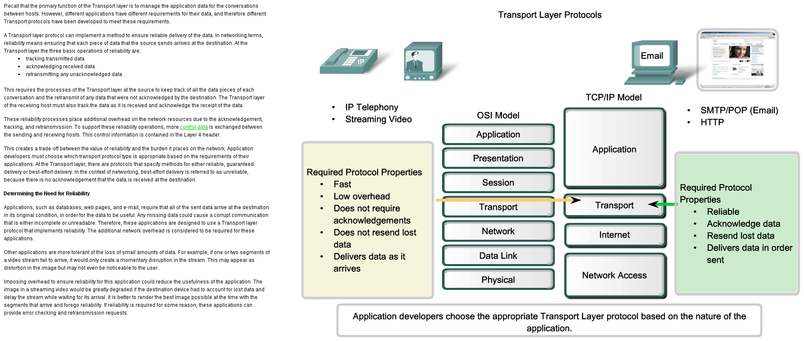
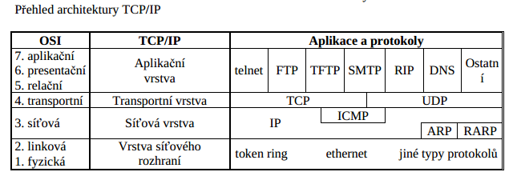
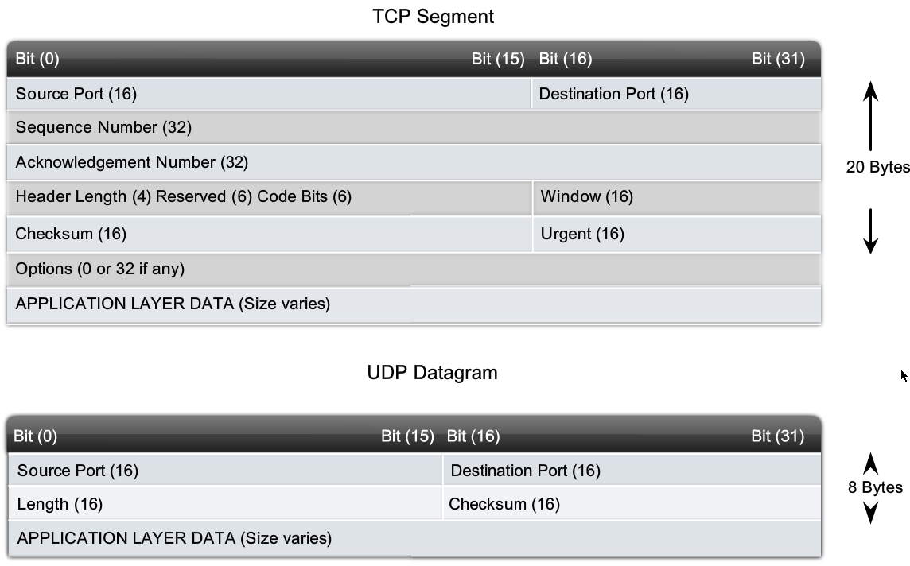
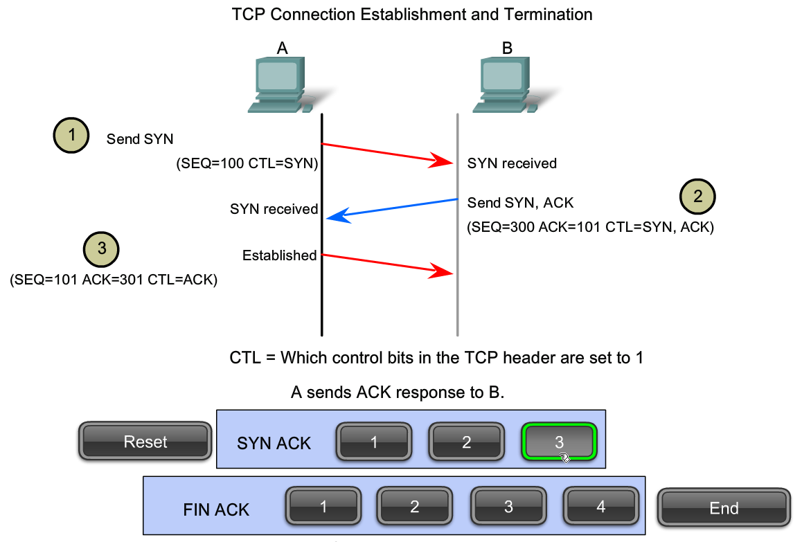

=======
8. ISO - OSI TCP/IP
=======

ISO-OSI - Open System Interconnection
---

referenční model mezinárodní organizace pro standardizaci ISO
řeší problematiku vzájemného propojování uzlů
definuje
* do kolika vrstev se problematika bude členit
* rozhraní jednotlivých vrstev
* jaké služby mají jednotlivé vrstvy poskytovat

*neřeší ale, jak mají být jednotlivé funkce realizovány*

*to řeší různé protokoly, které ale jsou ale zasazené do tohoto referenčních modelu
celkem sedm vrstev*

dají se rozdělit do dvou skupin
* přenosové
* aplikačně orientované

*na jejich pomezí je transportní vrstva – aby se obě skupiny „domluvily“*

Vrstvy
"""""""""

* aplikační vrstva
	přímo přístupná uživateli
	obsahuje aplikační protokoly, jejichž prostřednictvím komunikuje aplikace s OSI modelem
* prezentační vrstva
	zajišťuje převody kódů a formátů dat
	provádí kompresi a utajení dat
* relační vrstva
	vytváří logické rozhraní pro aplikační programy
	řídí komunikaci
	synchronizuje přenos
* transportní vrstva
	provádí fragmentaci a defragmentaci paketů
	vytváří záložní kopie pro případ opakování přenosu
	kontrolní součty
	protokol TCP
* síťová vrstva
	provádí výběr optimální cesty (směrování), tj. definuje způsob pohybu paketů po síti
	protokol IP
* linková vrstva
	vytváří rámce
	kontroluje přijaté duplicity
	provádění potvrzování
	zajišťuje adresaci
* fyzická vrstva
	převádění rámců 

TCP/IP - Transmission Control Protocol
------

Z ISO/OSI vychází i množina protokolů TCP/IP. Protokol TCP/IP vznikl původně jako 
komunikační protokol ministerstva obrany USA pro sjednocení počítačové komunikace v 
rámci ARPANET. Slouží ke komunikaci především v heterogenních sítích. Dnes je součástí 
prakticky všech operačních systémů (původně byl navrhován hlavně pro UNIX) a je využit ke 
komunikaci i v síti Internet. Z těchto důvodů vzrůstá jeho význam jako celosvětového 
standardu. 
Model TCP/IP je nezávislý na přenosovém mediu a je určen jak pro WAN tak i pro LAN, 
jak pro sériové linky, koaxiální kabely, tak i pro vysokorychlostní optické sítě. Je užíván v 
heterogenní síti (původně určené pro UNIX) Internet. Je to soustava sítí s IP protokolem 
tvořená mezisíťovým počítačem. Jednotlivé podsítě mohou být různé (Ethernet, X.25, ..). 
TCP/IP (Transmission Control Protocol/Internet Protokol) předpokládá, že na nižších 
vrstvách jsou pouze nespolehlivé přenosové služby. Zajištění spolehlivosti dělají vyšší vrstvy 
a to jen při jejich vyžádání. 

* zajišťuje virtuální spojení, virtuální okruh mezi koncovými aplikacemi => spolehlivý přenost dat
* pomocí sekvence potvrzování se zpětným přenosem paketů (je-li to nutné)
* doručí všechna data bez ztráty a ve správném pořadí
* jde o službu se spojením
* má tedy fáze navázání spojení, přenos dat a ukončení spojení
* plně duplexní spojení
* rozlišuje aplikace pomocí portů

Navázání komunikace
"""""""

Více
------

* :download:`Více `